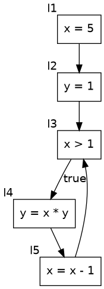

# COMP0174 Analyser

This is a program analyser for experimenting with Datalog-based analyses.

## Installation

The easiest way to use the analyser is through Docker, but you can also install Souffle, Graphviz and Python dependencies locally.

When using Docker, please build an analyser image:

    docker build . -t comp0174-analyser

## Usage

To run the analysis `rd_il1`, reaching definitions for IL1 defined in `examples/rd_il1.dl`, on the program `examples/rd.il1.c`, please execute the following command:

    docker run -ti --rm -v $PWD/examples:/comp0174/examples comp0174-analyser \
        python3 analyse.py --analysis examples/rd_il1.dl examples/rd.il1.c
    
The same analysis can be executed in three steps: (1) generating a Datalog EDB, (2) creating an output directory and executing Souffle, and (3) printing the result (using the volume `comp0174-vol` for persistent storage):

    docker run -ti --rm -v $PWD/examples:/comp0174/examples comp0174-analyser \
        python3 analyse.py --output-edb examples/edb examples/rd.il1.c
    
    docker run -ti --rm -v $PWD/examples:/comp0174/examples comp0174-analyser \
        mkdir examples/output
        
    docker run -ti --rm -v $PWD/examples:/comp0174/examples comp0174-analyser \
        souffle --fact-dir=examples/edb --output-dir=examples/output examples/rd_il1.dl

    cat examples/output/result.csv
        
## CFG Visualisation

COMP0174 analyser automatically assigns labels to elementary blocks of your program. To find how these labels are assigned, please view a visualisation of the control flow graph in the file `cfg.gv.pdf`:

    docker run -ti --rm -v $PWD/results:/comp0174/results comp0174-analyser \
        python3 analyse.py --output-edb examples/edb examples/rd.il1.c
        
Then, open the file `examples/edb/cfg.gv.pdf`. Here is an example for the program `examples/rd.il1.c`:

## Input Language

The input language is a subset of C with the following restrictions:

* A program is defined in a single file.
* A program consists of the single function `main` without parameters.
* Only the following statements are allowed:
  * Compound statements (blocks)
  * If conditions
  * While loops
  * Assignments
  * Function calls
  * Returns
* Function calls are only allowed as separate statements, not parts of expressions.
* Functions are not associated with any implementations and considered as black boxes.
* Pointer arithmetics is not allowed.
* Only integer types are allowed.
* Local variables do not need to (and cannot) be declared. As a result, all variables have the same scope.

We consider two variants of the input language:

* IL1: language without pointers
* IL2: language with pointers

## Datalog Relations

Analyses are defined as Datalog programs that read input relations, and write output in the relation `result`. COMP0174 Analyser transforms a given program to a set of input relations stored in `*.facts` files compatible with Souffle Datalog solver.

Input relations for IL1 and IL2:

* `label(L)`: `L` is a label of an elementary block. Labels are named as `l1`, `l23`, etc.
* `flow(L1,L2)`: there is an arc between `L1` and `L2` in the control flow graph.
* `init(L)`: `L` is the initial label.
* `final(L)`: `L` is the final label.
* `variable(V)`: `V` is a variable.
* `assignment(L)`: `L` is a label of an assignment statement.
* `condition(L)`: `L` is a label of an if or loop condition.
* `return(L)`: `L` is a label of a return statement.
* `function(M)`: `M` is a function.
* `call(M, L)`: the function `M` is called at the statement `L`.
* `call_arg_var(M, V, L)`: the function `M` is called at the statement `L` with the variable `V` being the sole argument.
* `call_arg_const(M, C, L)`: the function `M` is called at the statement `L` with a constant `C` being the sole argument.
* `used(V, L)`: one of the following is true:
  * `assignment(L)` and the variable `V` is used in the RHS of the assingment;
  * `condition(L)` and the variable `V` is used in the condition;
  * `call(M, L)` and the variable `V` is used in the arguments of the call;
  * `return(L)` and the variable `V` is used in the returned expression.
* `defined(V, L)`: `assignment(L)` and `V` is the LHS of the assignment.
* `rhs_var(V, L)`: `assignment(L)` and the variable `V` is the RHS of the assingment.
* `rhs_const(C, L)`: `assignment(L)` and the constant `C` is the RHS of the assingment.

Input relations only for IL2:

* `defined_deref(V, L)`: `assignment(L)` and a dereference of `V` is the LHS of the assignment.
* `used_deref(V, L)`: a subset of `used` such that one of the following is true:
  * `assignment(L)` and a dereference of `V` is used in the RHS of the assingment;
  * `condition(L)` and a dereference of `V` is used in the condition;
  * `call(M, L)` and a dereference of `V` is used in the arguments of the call;
  * `return(L)` and a dereference of `V` is used in the returned expression.
* `rhs_deref(V, L)`: `assignment(L)` and a dereference of `V` is the RHS of the assingment.
* `rhs_address(V, L)`: `assignment(L)` and an address of `V` is the RHS of the assingment.
* `call_arg_deref(M, V, L)`: the function `M` is called at the statement `L` with a dereference of `V` being the sole argument.
